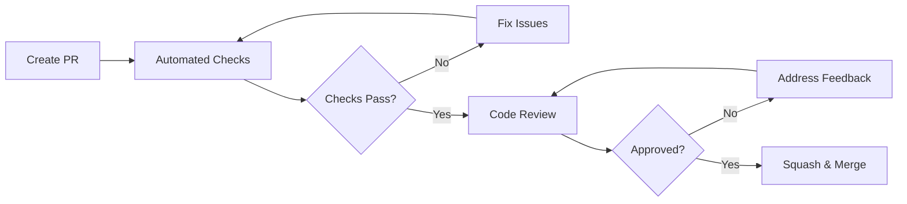

# Contributing to RepliMap

Thank you for your interest in contributing! This guide will help you get started.

## Table of Contents

- [Code of Conduct](#code-of-conduct)
- [Getting Started](#getting-started)
- [Development Workflow](#development-workflow)
- [Commit Guidelines](#commit-guidelines)
- [Pull Request Process](#pull-request-process)

## Code of Conduct

Please read and follow our [Code of Conduct](CODE_OF_CONDUCT.md).

## Getting Started

### Prerequisites

| Tool | Version | Platform |
|------|---------|----------|
| Node.js | 24.x | All |
| pnpm | 9.x | All |
| Python | 3.11+ | All |
| Make | any | Linux/macOS/WSL |

### Platform-Specific Setup

<details>
<summary>Linux</summary>

```bash
# Install Node.js 24 (using nvm)
nvm install 24
nvm use 24

# Enable pnpm
corepack enable

# Clone and setup
git clone https://github.com/RepliMap/replimap-mono.git
cd replimap-mono
make setup
```

</details>

<details>
<summary>macOS</summary>

```bash
# Install Node.js 24 (using Homebrew)
brew install node@24
# Or using nvm
nvm install 24

# Enable pnpm
corepack enable

# Clone and setup
git clone https://github.com/RepliMap/replimap-mono.git
cd replimap-mono
make setup
```

</details>

<details>
<summary>Windows</summary>

#### Recommended: WSL2

```powershell
# Install WSL2 with Ubuntu
wsl --install -d Ubuntu

# Inside WSL, follow Linux instructions
```

#### Alternative: Native Windows

```powershell
# Install Node.js from https://nodejs.org/
# Install Python from https://python.org/

# Enable pnpm
corepack enable

# Clone repository
git clone https://github.com/RepliMap/replimap-mono.git
cd replimap-mono

# Install dependencies
pnpm install

# Build packages
pnpm build

# Setup CLI
cd apps/cli
pip install -e ".[dev]"
```

#### PowerShell Command Reference

| Make Command | PowerShell Equivalent |
|--------------|----------------------|
| `make install` | `pnpm install` |
| `make build` | `pnpm build` |
| `make dev-web` | `pnpm --filter @replimap/web dev` |
| `make dev-api` | `pnpm --filter @replimap/api dev` |
| `make lint` | `pnpm lint` |
| `make test` | `pnpm test` |

</details>

## Development Workflow

### Branch Naming

| Prefix | Purpose | Example |
|--------|---------|---------|
| `feature/` | New features | `feature/terraform-export` |
| `fix/` | Bug fixes | `fix/scan-timeout` |
| `docs/` | Documentation | `docs/api-reference` |
| `refactor/` | Code refactoring | `refactor/graph-builder` |
| `chore/` | Maintenance | `chore/update-deps` |

### Running Locally

```bash
# Start all services (parallel)
make dev

# Or individually
make dev-web    # Web: http://localhost:3000
make dev-api    # API: http://localhost:8787
make dev-cli    # CLI: editable install
```

### Testing

```bash
make test       # Run all tests
make lint       # Run linters
make typecheck  # Type checking
make pre-commit # All checks (run before committing)
```

## Commit Guidelines

We follow [Conventional Commits](https://www.conventionalcommits.org/):

```
<type>(<scope>): <description>

[optional body]

[optional footer(s)]
```

### Types

| Type | Description | Triggers Release? |
|------|-------------|-------------------|
| `feat` | New feature | Minor |
| `fix` | Bug fix | Patch |
| `docs` | Documentation | No |
| `style` | Formatting | No |
| `refactor` | Code refactoring | No |
| `perf` | Performance | Patch |
| `test` | Adding tests | No |
| `chore` | Maintenance | No |
| `ci` | CI/CD changes | No |

### Scopes

| Scope | Package |
|-------|---------|
| `web` | apps/web |
| `api` | apps/api |
| `cli` | apps/cli |
| `config` | packages/config |
| `deps` | Dependencies |
| `ci` | GitHub Actions |

### Examples

```bash
feat(cli): add terraform export command
fix(api): resolve rate limiting issue
docs(readme): update installation instructions
chore(deps): update dependencies
perf(cli): optimize resource scanning by 40%
```

## Pull Request Process

### Before Submitting

- [ ] Run `make pre-commit` and ensure all checks pass
- [ ] Update documentation if needed
- [ ] Add tests for new features
- [ ] Update CHANGELOG.md for user-facing changes

### PR Title Format

Use Conventional Commits format:
```
feat(web): add dashboard analytics
fix(cli): resolve timeout on large scans
```

### Review Process



### What Reviewers Look For

- Code follows project style
- Tests cover new functionality
- Documentation is updated
- No unnecessary dependencies added
- Performance impact considered
- Security implications reviewed

## Questions?

- Open a [Discussion](https://github.com/RepliMap/replimap-mono/discussions)
- Email team@replimap.com
