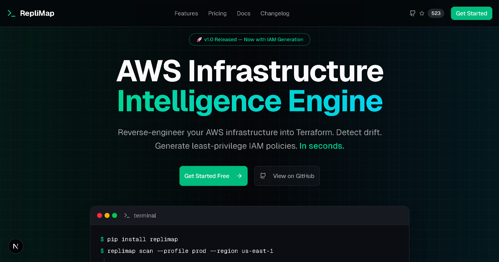

# RepliMap Frontend

**AWS Infrastructure Intelligence Engine — Landing Page & Dashboard**

[](LICENSE)
[](https://nextjs.org/)
[](https://www.typescriptlang.org/)

> **Looking for the CLI tool?** This repo contains the UI only. The core engine is a local CLI tool.
> Visit [replimap.com](https://replimap.com) or check the [documentation](https://replimap.com/docs).



## Quick Start

```bash
git clone https://github.com/RepliMap/replimap-frontend.git
cd replimap-frontend
cp .env.example .env.local
npm install
npm run dev
```

Open [http://localhost:3000](http://localhost:3000)

## Tech Stack

| Category | Technology |
|----------|------------|
| Framework | Next.js 16 (App Router) |
| Styling | Tailwind CSS v4 |
| Components | Shadcn UI |
| Language | TypeScript |
| Auth | Clerk |
| Payments | Stripe |

## Project Structure

```
src/
├── app/           # Next.js App Router pages
├── components/    # React components
│   ├── ui/        # Shadcn UI primitives
│   ├── landing/   # Landing page sections
│   └── shared/    # Header, Footer
└── lib/           # Utilities, constants
```

## License

[Apache 2.0](LICENSE) © 2025-2026 David Lu

## Links

- [Website](https://replimap.com)
- [Documentation](https://replimap.com/docs)
- [Twitter](https://twitter.com/replimap_io)
