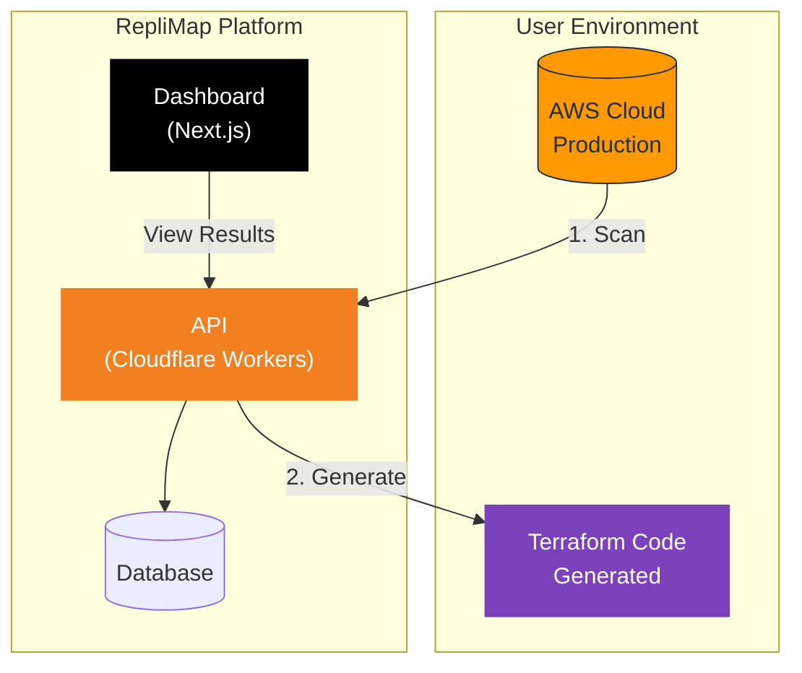

<div align="center">

# RepliMap

**AWS Infrastructure Intelligence Platform**

[](https://github.com/RepliMap/replimap-mono/actions/workflows/ci.yml)

[](https://nodejs.org/)
[](https://pnpm.io/)
[](https://www.typescriptlang.org/)
[](LICENSE)

[Website](https://replimap.com) | [Documentation](https://replimap.com/docs) | [Changelog](CHANGELOG.md)

</div>

---

## What is RepliMap?

RepliMap scans your AWS production environment and generates Terraform code to replicate it for staging, disaster recovery, or compliance testing.

### Architecture Overview



## Packages

| Package | Description | Version | Status |
|---------|-------------|---------|--------|
| [`@replimap/web`](./apps/web) | Next.js Dashboard | Internal | [](https://replimap.com) |
| [`@replimap/api`](./apps/api) | Hono API | Internal | [](https://api.replimap.com) |
| [`@replimap/config`](./packages/config) | Shared Config | Internal | - |

## Development

### Prerequisites

| Tool | Version | Installation | Notes |
|------|---------|--------------|-------|
| Node.js | 24.x | [nodejs.org](https://nodejs.org/) | Required for web/api |
| pnpm | 9.x | `corepack enable` | Package manager |
| Make | any | Pre-installed on Linux/macOS | See Windows section |

### Setup

```bash
# Clone the repository
git clone https://github.com/RepliMap/replimap-mono.git
cd replimap-mono

# First-time setup (installs all dependencies)
make setup

# Start development servers
make dev-web   # Web on http://localhost:3000
make dev-api   # API on http://localhost:8787
```

### Available Commands

Run `make help` for full list. Key commands:

```bash
# Development
make dev          # Start all dev servers
make build        # Build all packages
make test         # Run all tests

# Quality
make lint         # Run linters
make typecheck    # Type checking
make pre-commit   # All checks before committing

# Deployment
make deploy-web   # Deploy to Vercel
make deploy-api   # Deploy to Cloudflare

# Utilities
make info         # Show environment info
make clean        # Clean build artifacts
```

### Windows Development

<details>
<summary>Click to expand Windows setup instructions</summary>

#### Option 1: WSL2 (Recommended)

```powershell
# Install WSL2 with Ubuntu
wsl --install -d Ubuntu

# Inside WSL, follow standard Linux setup
cd /mnt/c/path/to/replimap-mono
make setup
```

#### Option 2: PowerShell Commands

If you cannot use WSL, here are PowerShell equivalents:

```powershell
# Install dependencies
corepack enable
pnpm install

# Build
pnpm build

# Development
pnpm --filter @replimap/web dev
pnpm --filter @replimap/api dev
```

#### Option 3: Git Bash

Install [Git for Windows](https://gitforwindows.org/) which includes Git Bash, then run `make` commands normally.

</details>

## Project Structure

```
replimap-mono/
├── apps/
│   ├── web/              # Next.js 16 frontend
│   │   ├── src/
│   │   ├── package.json
│   │   └── vercel.json
│   └── api/              # Hono + Cloudflare Workers
│       ├── src/
│       ├── package.json
│       └── wrangler.toml
├── packages/
│   └── config/           # Shared configuration
│       ├── src/          # JSON source files
│       ├── dist/         # Generated TS
│       └── scripts/
├── .github/
│   ├── workflows/        # CI/CD pipelines
│   ├── ISSUE_TEMPLATE/   # Bug/feature templates
│   └── CODEOWNERS
├── Makefile              # Development commands
├── turbo.json            # Turborepo config
├── CHANGELOG.md
├── CONTRIBUTING.md
├── SECURITY.md
└── LICENSE
```

## Security

We take security seriously. Our security measures include:

- **OIDC-based publishing** - No long-lived secrets for deployments
- **Dependabot** - Automated dependency updates
- **SOC2 compliance** - Enterprise-grade infrastructure

See [SECURITY.md](SECURITY.md) for vulnerability reporting.

## License

This project is proprietary software. See [LICENSE](LICENSE) for details.

## Contributing

We welcome contributions! See [CONTRIBUTING.md](CONTRIBUTING.md) for guidelines.

## Citation

If you use RepliMap in academic work, please cite:

```bibtex
@software{replimap,
  title = {RepliMap: AWS Infrastructure Intelligence Platform},
  author = {RepliMap Team},
  year = {2025},
  url = {https://github.com/RepliMap/replimap-mono}
}
```

---

<div align="center">

**Built with care in New Zealand**

</div>
