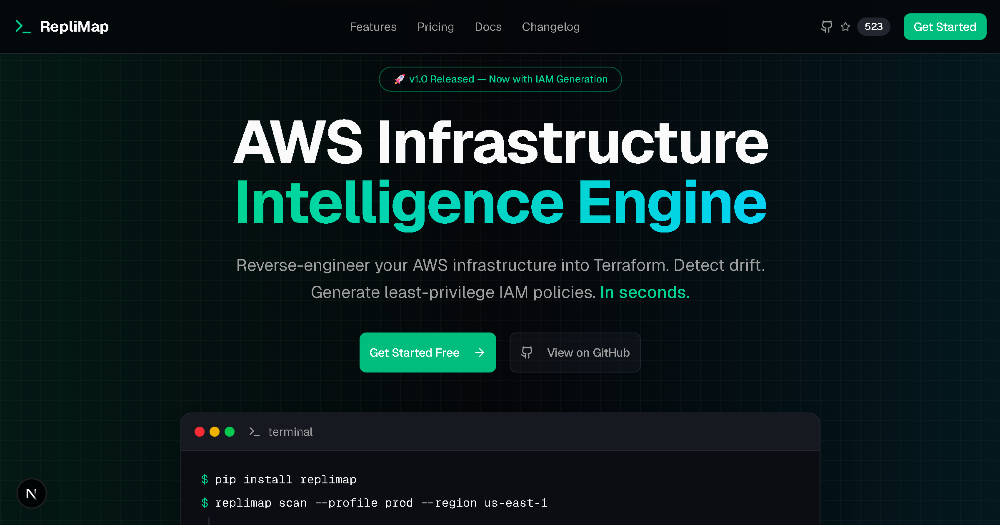

# RepliMap Frontend

**AWS Infrastructure Intelligence Engine — Landing Page & Dashboard**

[](LICENSE)
[](https://nextjs.org/)
[](https://www.typescriptlang.org/)

> **Looking for the CLI tool?** This repo contains the UI only. The core engine is a local CLI tool.
> Visit [replimap.com](https://replimap.com) or check the [documentation](https://replimap.com/docs).



## Quick Start

```bash
git clone https://github.com/RepliMap/replimap-frontend.git
cd replimap-frontend
cp .env.example .env.local
npm install
npm run dev
```

Open [http://localhost:3000](http://localhost:3000)

## Tech Stack

| Category | Technology |
|----------|------------|
| Framework | Next.js 16 (App Router) |
| Styling | Tailwind CSS v4 |
| Components | Shadcn UI |
| Language | TypeScript |
| Auth | Clerk |
| Payments | Stripe |

## Project Structure

```
src/
├── app/
│   ├── (auth)/           # Clerk sign-in/sign-up pages
│   ├── (marketing)/      # Landing page (public)
│   ├── checkout/         # Stripe checkout flow (auth required)
│   │   ├── page.tsx      # Plan summary + redirect to Stripe
│   │   └── success/      # Post-payment onboarding
│   ├── dashboard/        # User dashboard (auth required)
│   └── docs/             # Documentation (Fumadocs)
├── components/
│   ├── ui/               # Shadcn UI primitives
│   ├── hero.tsx          # Landing page hero
│   ├── pricing.tsx       # Pricing cards
│   ├── header.tsx        # Site header with auth
│   └── auth-components.tsx  # Clerk wrapper components
└── lib/
    ├── api.ts            # Backend API client
    └── pricing.ts        # Plan definitions
```

## Checkout Flow

```
User clicks CTA
  → Clerk sign-in (if not authenticated)
    → /checkout?plan=pro&billing=monthly
      → Shows plan summary, billing toggle
      → "Continue to Payment" calls POST /v1/checkout/session
        → Redirects to Stripe hosted checkout
          → On success: /checkout/success
            → Shows: pip install, auth login, scan
          → On cancel: back to /checkout
```

**Protected routes** (require Clerk auth): `/dashboard(.*)`, `/checkout(.*)`

**Environment variables:**

| Variable | Description |
|----------|-------------|
| `NEXT_PUBLIC_CLERK_PUBLISHABLE_KEY` | Clerk auth (pk_test_ or pk_live_) |
| `CLERK_SECRET_KEY` | Clerk server key |
| `NEXT_PUBLIC_STRIPE_PUBLISHABLE_KEY` | Stripe publishable key |
| `STRIPE_SECRET_KEY` | Stripe secret key |
| `NEXT_PUBLIC_APP_URL` | App URL (http://localhost:3000) |
| `NEXT_PUBLIC_API_URL` | API URL (http://localhost:8787) |

## License

[Apache 2.0](LICENSE) © 2025-2026 David Lu

## Links

- [Website](https://replimap.com)
- [Documentation](https://replimap.com/docs)
- [Twitter](https://twitter.com/replimap_io)
