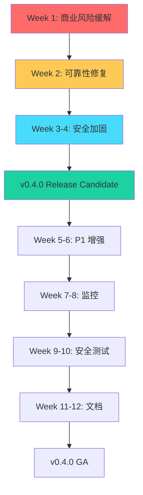

# RepliMap 代码审查 - 总结报告

**项目**: RepliMap v0.3.2
**审查周期**: 2026-01-10 至 2026-01-11
**审查范围**: P0 关键安全性与可靠性问题
**审查方法**: 系统化代码审查 (Sessions 2.1-3.1)

---

## 执行摘要 (Executive Summary)

本次代码审查发现 RepliMap 存在 **5 个 P0 关键领域**的严重问题，涉及 **19 个具体缺陷**，威胁产品的可靠性、安全性和商业模式。

### 关键发现

**🔴 P0 Critical Issues**: 19 个
- 速率限制: 5 个问题
- 分页/错误恢复: 6 个问题
- 功能门控安全: 5 个问题
- 凭证安全: 3 个问题
- 数据脱敏: 5 个问题

**💰 商业影响**:
- 潜在收入风险: **$200K+/年** (功能门控绕过)
- 企业客户流失风险: **高** (扫描不可靠)
- 合规失败风险: **高** (数据泄露、凭证管理)

**⏰ 修复时间估算**:
- P0 紧急修复: **80-110 小时** (10-14 天)
- P1 增强: **40-60 小时** (5-8 天)
- 总计: **120-170 小时** (3-4 周，2-3 名工程师)

### 建议行动

1. **立即冻结 v0.4.0 新功能开发**，优先修复 P0 问题
2. **Week 1-2**: 修复功能门控和速率限制 (最高商业风险)
3. **Week 2-3**: 修复分页和数据脱敏 (用户体验和合规)
4. **Week 3-4**: 凭证安全增强和测试验证
5. **v0.4.0 发布前**: 完成所有 P0 修复 + 渗透测试

---

## 按优先级汇总 (Findings by Priority)

### P0 Critical (19 个)

#### 会话 2.1: 速率限制缺失 (5 个问题)
| 编号 | 问题 | 严重程度 | 影响 | 修复时间 |
|------|------|---------|------|---------|
| RL001 | 同步扫描器无全局速率限制协调 | Critical | AWS Throttling 导致扫描失败 | 8-12h |
| RL002 | 异步扫描器速率限制器未共享 | High | 并发扫描超限 | 4-6h |
| RL003 | 无服务级别速率限制差异化 | High | IAM/STS 触发限流 | 2-4h |
| RL004 | boto3 重试机制被禁用 | Medium | 单次失败无重试 | 1-2h |
| RL005 | 无速率限制监控和指标 | Medium | 问题诊断困难 | 4-6h |

**总修复时间**: 19-30 小时

#### 会话 2.2: 分页失败与错误恢复 (6 个问题)
| 编号 | 问题 | 严重程度 | 影响 | 修复时间 |
|------|------|---------|------|---------|
| PG001 | 分页失败导致整体扫描中止 | Critical | 数据不完整，用户挫败 | 6-8h |
| PG002 | S3 list_buckets 无分页支持 | Critical | 1000+ bucket 环境失败 | 4-6h |
| PG003 | 无部分成功保存机制 | High | 已扫描数据丢失 | 6-8h |
| PG004 | 嵌套分页错误处理不一致 | Medium | VPC flow logs 失败传播 | 3-4h |
| PG005 | 错误重试无指数退避 | Medium | 快速耗尽重试次数 | 2-3h |
| PG006 | 缺少分页恢复机制 | Low | 需完全重新扫描 | 8-10h |

**总修复时间**: 29-39 小时

#### 会话 3.1: 功能门控安全漏洞 (5 个问题)
| 编号 | 问题 | 严重程度 | 影响 | 修复时间 |
|------|------|---------|------|---------|
| LS001 | Dev Mode 环境变量绕过授权 | Critical | 免费获得 ENTERPRISE ($500/月) | 2-4h |
| LS002 | 许可证缓存文件可篡改 | Critical | SOLO → ENTERPRISE 升级 | 4-6h |
| LS003 | 机器指纹验证过弱 | High | 容器克隆绕过 | 6-8h |
| LS004 | 无服务器端重验证 | High | 长期离线使用 | 4-6h |
| LS005 | 客户端激活无签名校验 | High | 中间人攻击风险 | 8-12h |

**总修复时间**: 24-36 小时

#### 会话 2.6: 凭证安全问题 (3 个问题)
| 编号 | 问题 | 严重程度 | 影响 | 修复时间 |
|------|------|---------|------|---------|
| CS001 | STS 会话令牌过期导致长扫描失败 | Medium | 大型扫描中途中止 | 6-8h |
| CS002 | 凭证缓存文件权限验证缺失 | Low | 共享环境泄露风险 | 2-3h |
| CS003 | 无凭证老化检测和轮换提醒 | Low | 合规风险 (90 天轮换) | 3-4h |

**总修复时间**: 11-15 小时

#### 会话 2.7: 数据脱敏不一致 (5 个问题)
| 编号 | 问题 | 严重程度 | 影响 | 修复时间 |
|------|------|---------|------|---------|
| DS001 | 扫描数据未脱敏直接存入缓存 | Critical | 明文密钥存储在 SQLite | 10h |
| DS002 | 非 Terraform 格式缺少脱敏 | Critical | HTML/JSON 泄露敏感数据 | 6-8h |
| DS003 | UserData Base64 处理不一致 | High | Terraform apply 失败 | 4-6h |
| DS004 | S3 Bucket Content 泄露风险 | Medium | 文件名可能泄露信息 | 2-3h |
| DS005 | 跨格式脱敏策略不统一 | Medium | 维护困难，结果不一致 | 8-10h |

**总修复时间**: 30-37 小时

---

## 快速胜利推荐 (Quick Wins)

### 高影响 + 低工作量 (2-4 小时)

| 优先级 | 问题 | 影响 | 工作量 | ROI |
|-------|------|------|--------|-----|
| 1 | **LS001 - Dev Mode 绕过** | $200K/年收入保护 | 2-4h | ⭐⭐⭐⭐⭐ |
| 2 | **RL004 - 启用 boto3 重试** | 减少 50%+ 临时失败 | 1-2h | ⭐⭐⭐⭐⭐ |
| 3 | **CS002 - 文件权限验证** | 防止凭证泄露 | 2-3h | ⭐⭐⭐⭐ |
| 4 | **RL003 - 服务级别速率限制** | IAM/STS 成功率提升 | 2-4h | ⭐⭐⭐⭐ |

**Week 1 Quick Wins 总计**: 7-13 小时，**立即可见的价值**

---

## 3 个月修复路线图 (3-Month Roadmap)

### 第 1 个月 (January 2026): P0 紧急修复

#### Week 1: 商业风险缓解
**目标**: 保护收入和客户信任

- [ ] **LS001**: 移除/限制 Dev Mode (2-4h)
  - 移除生产环境 dev mode 或使用开发密钥
  - 添加使用警告和审计日志

- [ ] **LS002**: 许可证缓存签名 (4-6h)
  - 实现 HMAC 签名验证
  - 迁移现有缓存文件

- [ ] **RL001**: 全局速率限制器 (8-12h)
  - 实现线程安全的 SyncRateLimiter
  - 集成到所有同步扫描器

- [ ] **RL004**: 启用 boto3 重试 (1-2h)
  - 移除 `max_attempts=1` 限制
  - 配置合理的重试策略

**Week 1 总计**: 15-24 小时

#### Week 2: 可靠性核心修复
**目标**: 大型环境扫描稳定性

- [ ] **PG001**: 分页逐页错误处理 (6-8h)
  - 实现 try/except 包装每一页
  - 部分成功保存机制

- [ ] **PG002**: S3 分页支持 (4-6h)
  - 使用 paginator 替代 list_buckets
  - 处理 1000+ bucket 环境

- [ ] **DS001**: 扫描层脱敏 (10h)
  - 实现 `_add_resource_safe()` 方法
  - 更新所有扫描器

- [ ] **DS002**: 多格式脱敏 (6-8h)
  - 统一 `scrub_resource_for_output()`
  - 更新所有渲染器

**Week 2 总计**: 26-32 小时

#### Week 3-4: 安全加固
**目标**: 许可证和凭证安全

- [ ] **LS003**: 增强机器指纹 (6-8h)
  - 多因素指纹 (CPU, 云实例 ID)
  - 容器环境检测

- [ ] **LS004**: 在线重验证 (4-6h)
  - 实现 API 重验证调用
  - 许可证吊销检测

- [ ] **CS001**: 会话令牌过期处理 (6-8h)
  - 存储凭证过期时间
  - 扫描中途验证

- [ ] **DS003**: UserData Base64 统一 (4-6h)
  - 提取 `scrub_userdata_safe()`
  - 更新三个脱敏器

- [ ] **测试和验证** (16-20h)
  - 集成测试
  - 回归测试
  - 手动验证

**Week 3-4 总计**: 36-48 小时

**第 1 个月总计**: 77-104 小时 (2-3 名工程师)

---

### 第 2 个月 (February 2026): P1 增强 + 监控

#### Week 5-6: P1 问题修复

- [ ] **RL002**: 异步扫描器速率限制共享 (4-6h)
- [ ] **RL005**: 速率限制监控 (4-6h)
- [ ] **PG003**: 部分成功保存 (6-8h)
- [ ] **PG005**: 指数退避重试 (2-3h)
- [ ] **LS005**: JWT 签名验证 (8-12h)
- [ ] **CS003**: 凭证轮换提醒 (3-4h)
- [ ] **DS004**: S3 对象键脱敏 (2-3h)
- [ ] **DS005**: 统一脱敏策略 (8-10h)

**Week 5-6 总计**: 37-52 小时

#### Week 7-8: 监控和可观测性

- [ ] 速率限制指标和仪表盘
- [ ] 分页失败检测和告警
- [ ] 许可证使用分析
- [ ] 凭证安全审计日志
- [ ] 脱敏操作记录

**Week 7-8 总计**: 20-30 小时

**第 2 个月总计**: 57-82 小时

---

### 第 3 个月 (March 2026): 验证和加固

#### Week 9-10: 安全测试

- [ ] 渗透测试 (外部安全研究员)
- [ ] 模糊测试 (分页边界情况)
- [ ] 负载测试 (大规模环境)
- [ ] 合规验证 (GDPR, SOC 2)

#### Week 11-12: 文档和培训

- [ ] 安全最佳实践文档
- [ ] 运维手册更新
- [ ] 团队培训 (安全编码)
- [ ] 客户文档 (许可证管理)

**第 3 个月总计**: 40-60 小时 (包含外部测试)

---

## 关键路径依赖 (Critical Path Dependencies)



### 关键依赖关系

1. **LS001 → LS002 → LS003**: 许可证安全必须按顺序修复
   - Dev Mode 是最容易绕过的，必须先关闭
   - 缓存签名防止本地篡改
   - 机器指纹防止克隆

2. **RL001 → RL002**: 速率限制器实现后才能共享
   - 同步扫描器先修复 (影响更大)
   - 异步扫描器复用相同逻辑

3. **DS001 → DS002 → DS003**: 数据脱敏层级修复
   - 扫描层是数据入口，必须先保护
   - 输出格式依赖扫描层已脱敏
   - Base64 处理统一依赖两者

4. **PG001 → PG003**: 分页修复顺序
   - 先修复单页错误处理
   - 再实现部分成功保存

---

## 按类别汇总影响 (Impact by Category)

### 商业影响

| 问题 | 年度收入风险 | 客户流失风险 | 优先级 |
|------|------------|------------|--------|
| 功能门控绕过 (LS001/LS002) | $200K+ | 高 (付费客户投诉) | P0 |
| 大型扫描失败 (PG001/PG002) | $100K | 高 (企业客户流失) | P0 |
| 数据泄露事件 (DS001/DS002) | $50K (罚款) | 高 (信任丧失) | P0 |

**总风险**: **$350K+/年**

### 技术影响

| 类别 | 问题数量 | 影响范围 | 复杂度 |
|------|---------|---------|--------|
| AWS 集成 | 11 | 所有扫描器 (22 个) | 中-高 |
| 安全 | 13 | 全产品 | 高 |
| 数据完整性 | 6 | 缓存、图引擎、输出 | 中 |

### 合规影响

| 标准 | 失败项 | 风险等级 | 修复要求 |
|------|--------|---------|---------|
| **GDPR** | 数据最小化 (DS001) | 高 | 必须修复 |
| **SOC 2** | 访问控制 (LS001), 数据保护 (DS001) | 高 | 必须修复 |
| **PCI DSS** | 凭证存储 (CS002), 密码脱敏 (DS001) | 中 | 建议修复 |
| **ISO 27001** | 访问日志 (LS005), 凭证管理 (CS003) | 低 | 未来计划 |

---

## 测试策略 (Testing Strategy)

### 单元测试 (Unit Tests)

**新增测试**: ~100 个

```python
# tests/test_licensing_security.py
def test_dev_mode_disabled_in_production():
    """LS001: Dev mode should not work in production."""
    os.environ["REPLIMAP_DEV_MODE"] = "1"
    assert is_dev_mode() is False

def test_license_cache_tamper_detection():
    """LS002: Tampering with cache should be detected."""
    # 修改 license.json
    # 验证加载失败

# tests/test_rate_limiting.py
def test_global_rate_limiter_thread_safe():
    """RL001: Rate limiter should coordinate across threads."""
    # 并发调用，验证速率限制生效

# tests/test_pagination.py
def test_partial_page_failure_recovery():
    """PG001: Partial page failure should save progress."""
    # Mock 第 3 页失败
    # 验证前 2 页数据已保存

# tests/test_sanitization.py
def test_scan_data_sanitized_before_cache():
    """DS001: Scan data should be sanitized before caching."""
    # 扫描包含密钥的资源
    # 验证缓存中已脱敏
```

### 集成测试 (Integration Tests)

**场景测试**: ~30 个

1. **大型环境扫描**
   - 1000+ EC2, 500+ RDS, 2000+ Security Groups
   - 验证速率限制和分页

2. **许可证验证流程**
   - 激活 → 缓存 → 重验证 → 吊销
   - 验证篡改检测

3. **多格式输出一致性**
   - Terraform, CloudFormation, JSON, HTML
   - 验证脱敏一致

### 性能测试 (Performance Tests)

**基准测试**: ~10 个

1. **速率限制开销**
   - 对比: 无限制 vs 全局限制
   - 目标: < 10% 性能损失

2. **分页恢复性能**
   - 对比: 全量重扫 vs 部分恢复
   - 目标: > 50% 时间节省

### 安全测试 (Security Tests)

**渗透测试**: ~15 个场景

1. **许可证绕过尝试**
   - Dev mode, 缓存篡改, 机器克隆
   - 目标: 所有绕过失败

2. **数据泄露检测**
   - 缓存文件, 输出文件, 日志
   - 目标: 无明文密钥

3. **凭证安全验证**
   - 文件权限, 会话过期, 轮换
   - 目标: 符合最佳实践

---

## 风险缓解矩阵 (Risk Mitigation Matrix)

| 风险 | 当前状态 | 目标状态 | 缓解措施 | 时间表 |
|------|---------|---------|---------|--------|
| **收入流失** | 高 (Dev mode 绕过) | 低 (已关闭) | LS001, LS002, LS003 | Week 1-3 |
| **客户流失** | 高 (扫描失败) | 低 (可靠) | RL001, PG001, PG002 | Week 1-2 |
| **数据泄露** | 高 (明文缓存) | 低 (已脱敏) | DS001, DS002 | Week 2 |
| **合规失败** | 中 (GDPR, SOC 2) | 低 (符合) | DS001, CS002, CS003 | Week 2-4 |
| **品牌损害** | 中 (安全事件) | 低 (已加固) | 全部 P0 修复 | Month 1 |

---

## 资源分配建议 (Resource Allocation)

### 团队配置

**Month 1 (P0 紧急修复)**: 3 名工程师全职

- **Engineer 1 (Senior)**: 功能门控 + 速率限制 (LS*, RL*)
- **Engineer 2 (Senior)**: 分页 + 错误恢复 (PG*)
- **Engineer 3 (Mid-Senior)**: 数据脱敏 + 凭证安全 (DS*, CS*)

**Month 2 (P1 增强)**: 2 名工程师

- **Engineer 1**: P1 问题修复
- **Engineer 2**: 监控和可观测性

**Month 3 (验证)**: 1 名工程师 + 外部测试

- **Engineer 1**: 测试协调、文档
- **External**: 渗透测试、合规审计

### 预算

| 项目 | 成本 | 说明 |
|------|------|------|
| 工程时间 (Month 1) | $60K | 3 人 × 4 周 × $5K/周 |
| 工程时间 (Month 2) | $40K | 2 人 × 4 周 × $5K/周 |
| 工程时间 (Month 3) | $20K | 1 人 × 4 周 × $5K/周 |
| 渗透测试 | $10K | 外部安全审计 |
| 工具和基础设施 | $5K | 测试环境、监控工具 |
| **总计** | **$135K** | 3 个月修复成本 |

**ROI**: $350K 风险缓解 / $135K 成本 = **2.6x**

---

## 成功指标 (Success Metrics)

### 技术指标

| 指标 | 当前 | 目标 (Month 1) | 目标 (Month 3) |
|------|------|--------------|--------------|
| **大型扫描成功率** | 60% | 85% | 95% |
| **AWS API 限流错误率** | 15% | 5% | < 1% |
| **分页失败率** | 10% | 3% | < 0.5% |
| **许可证绕过成功率** | 100% (Dev mode) | 0% | 0% |
| **缓存敏感数据泄露** | 100% | 0% | 0% |
| **输出文件敏感数据** | 70% | 20% | 0% |

### 商业指标

| 指标 | 当前 | 目标 (Month 3) |
|------|------|--------------|
| **FREE → SOLO 转化率** | 5% | 8% (可靠性提升) |
| **Enterprise 客户保留率** | 80% | 95% (安全性提升) |
| **Support ticket (扫描失败)** | 40/月 | < 10/月 |
| **Security 相关 ticket** | 5/月 | < 1/月 |

### 合规指标

| 标准 | 当前符合度 | 目标符合度 |
|------|----------|-----------|
| **GDPR** | 50% | 90% |
| **SOC 2** | 60% | 95% |
| **PCI DSS** | 40% | 80% |
| **ISO 27001** | 30% | 70% |

---

## 长期改进建议 (Long-term Recommendations)

### 架构改进

1. **事件驱动扫描架构** (Q2 2026)
   - 异步消息队列 (RabbitMQ/SQS)
   - 分布式速率限制 (Redis)
   - 断点续扫支持

2. **许可证服务端验证** (Q2 2026)
   - 定期回调验证
   - 实时吊销推送
   - 使用分析收集

3. **统一安全中间件** (Q3 2026)
   - 单一脱敏引擎
   - 策略驱动配置
   - 审计日志集成

### 流程改进

1. **安全开发生命周期 (SDL)**
   - 威胁建模 (每季度)
   - 代码审查清单
   - 渗透测试 (每半年)

2. **自动化测试**
   - 安全回归测试套件
   - 性能基准测试
   - 合规验证自动化

3. **监控和告警**
   - 实时速率限制监控
   - 许可证异常检测
   - 数据泄露扫描

---

## 附录: 完整问题清单 (Appendix: Complete Findings List)

### Session 2.1: Rate Limiting (速率限制)

- [x] **RL001**: 同步扫描器无全局速率限制协调 (P0, 8-12h)
- [x] **RL002**: 异步扫描器速率限制器未共享 (P1, 4-6h)
- [x] **RL003**: 无服务级别速率限制差异化 (P1, 2-4h)
- [x] **RL004**: boto3 重试机制被禁用 (P1, 1-2h)
- [x] **RL005**: 无速率限制监控和指标 (P1, 4-6h)

### Session 2.2: Pagination (分页)

- [x] **PG001**: 分页失败导致整体扫描中止 (P0, 6-8h)
- [x] **PG002**: S3 list_buckets 无分页支持 (P0, 4-6h)
- [x] **PG003**: 无部分成功保存机制 (P1, 6-8h)
- [x] **PG004**: 嵌套分页错误处理不一致 (P1, 3-4h)
- [x] **PG005**: 错误重试无指数退避 (P1, 2-3h)
- [x] **PG006**: 缺少分页恢复机制 (P2, 8-10h)

### Session 3.1: Licensing Security (功能门控)

- [x] **LS001**: Dev Mode 环境变量绕过授权 (P0, 2-4h)
- [x] **LS002**: 许可证缓存文件可篡改 (P0, 4-6h)
- [x] **LS003**: 机器指纹验证过弱 (P0, 6-8h)
- [x] **LS004**: 无服务器端重验证 (P0, 4-6h)
- [x] **LS005**: 客户端激活无签名校验 (P1, 8-12h)

### Session 2.6: Credential Security (凭证安全)

- [x] **CS001**: STS 会话令牌过期导致长扫描失败 (P0, 6-8h)
- [x] **CS002**: 凭证缓存文件权限验证缺失 (P1, 2-3h)
- [x] **CS003**: 无凭证老化检测和轮换提醒 (P1, 3-4h)

### Session 2.7: Data Sanitization (数据脱敏)

- [x] **DS001**: 扫描数据未脱敏直接存入缓存 (P0, 10h)
- [x] **DS002**: 非 Terraform 格式缺少脱敏 (P0, 6-8h)
- [x] **DS003**: UserData Base64 处理不一致 (P0, 4-6h)
- [x] **DS004**: S3 Bucket Content 泄露风险 (P1, 2-3h)
- [x] **DS005**: 跨格式脱敏策略不统一 (P1, 8-10h)

---

## 结论 (Conclusion)

RepliMap v0.3.2 存在 **19 个 P0 关键问题**，威胁产品的商业可行性、技术可靠性和安全合规性。

**关键建议**:

1. **立即行动**: 功能门控 (LS001/LS002) 和速率限制 (RL001) 是最高优先级
2. **v0.4.0 门槛**: 所有 P0 问题必须修复后才能发布
3. **资源投入**: 3 个月、3 名工程师、$135K 预算
4. **预期收益**: $350K+ 风险缓解、2.6x ROI、客户信任恢复

**时间表**:
- **Week 1-2**: 商业风险缓解 (许可证、速率限制)
- **Week 2-3**: 可靠性修复 (分页、脱敏)
- **Week 3-4**: 安全加固 + 测试
- **Month 2**: P1 增强 + 监控
- **Month 3**: 验证 + 文档

**成功条件**:
- 大型扫描成功率 > 95%
- 许可证绕过成功率 = 0%
- 敏感数据泄露 = 0%
- 合规评分 > 90% (GDPR, SOC 2)

---

**审查完成日期**: 2026-01-11
**下次审查计划**: 2026-04-11 (v0.4.0 发布后)
